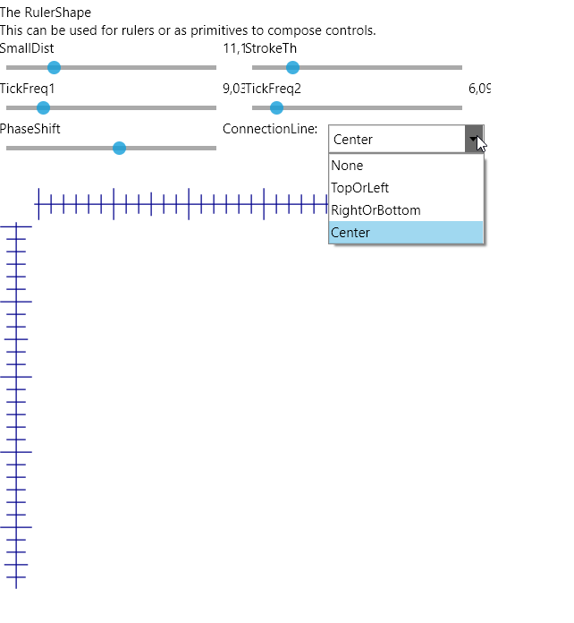

# AvaDevBox
Controls for AvaloniaUI developers

This just emerging as a brilliant collection of lookless AvaloniaUI controls
to be used in GUI applications. 

## License
See [License.md].

## Design goals

Goals are:
* Having i18n in mind
* Easy and intuitive to use
* Primary lookless design
* Well made architecture
* Well documented
* All the necessities on  board
* Runs on all AvaloniaUI platforms

## Current status
Instable

Do not yet rely on it. It is work in progress. Even AvaloniaUI still does breaking changes from release
to release. So everything is in flow. But feel free to use some and adhere to the license by mentioning
the author.

## Releases

No releases yet. Planned.

## Examples of contained controls

* MenuButton
* RatingControl
* Star shape
* LedIndicator
* LedButton
* RangeSlider
* WheelSlider

### Detail:

* MenuButton is a control that allows a popout with additional Controls. 

* WheelSlider: This is a kind of slider. In fact it looks like a wheel inset into
  the surface. The user can just move the wheel and thus change the value.
  It supports wrap around and a speed up factor.

# We do even have some newer Panels included:

* EquiSpreadWrapPanel

This is primarily a wrap panel WrapPanel that holds an arbitrary number
of childs. The difference to WrapPanel is that it spreads its childs to the whole width
(if orientation is Horizontal) or height respectively. That for every line individually.
This happens if ItemWidth or ItemHeight are set to double.NaN.
If you set an  ItemWidth or ItemHeight, though, all items will have that
height/width applied. Since items are still spread equally about the space (but in the last line),
this is the right panel to use, if you want to make a gallery like listing.

# And of course some utilities

like 

* DockEnum 
    This allows to use enums in XAML as a markup extension:

    

    Seealso: 

